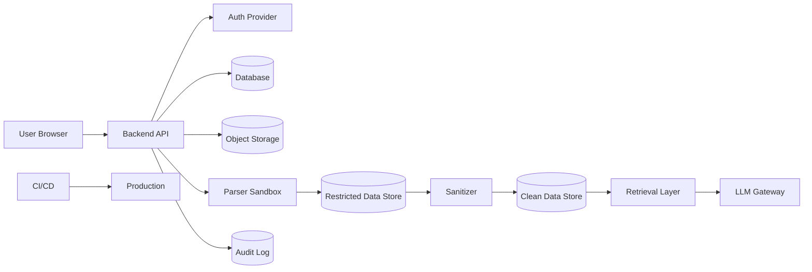

# System Context and Trust Boundaries

This file describes the system as an attacker would see it.

Every external entity, process, data store, trust boundary, and sensitive data flow must be visible here.

## External Entities

| Entity | Description | Trust Level | Notes |
|---|---|---|---|
| Anonymous user | Unauthenticated internet user | Untrusted | TBD |
| Authenticated user | Logged-in user | Partially trusted | Must be authorized per object/action |
| Admin user | Privileged user | Trusted but high-risk | Must be audited |
| Service account | Machine identity | Scoped trust | Least privilege required |
| Third-party API | External service | External trust boundary | Data-sharing review required |
| LLM provider/model | External or internal model boundary | Untrusted for secrets/restricted data by default | Prompt/data controls required |
| CI/CD platform | Build/deploy system | High-impact trust boundary | Least privilege required |

## System Components

| Component | Purpose | Zone | Sensitive? |
|---|---|---|---:|
| Web client | User interface | Public zone | Yes, displays data |
| API backend | Business logic | API zone | Yes |
| Database | Persistent data | Data zone | Yes |
| Object storage | Uploaded files/artifacts | Restricted or clean data zone | Yes |
| Parser/sandbox | File processing | Sandbox zone | Yes |
| Sanitizer | De-identification/classification | Restricted-to-clean bridge | Yes |
| LLM gateway | Controlled model access | AI zone | Yes |
| Vector store | Retrieval index | Clean/sensitive data zone | Yes |
| Audit log | Security event record | Audit zone | Yes |
| CI/CD | Build/release | Build zone | Yes |

## Trust Boundaries

| Boundary ID | From | To | Risk | Required Control |
|---|---|---|---|---|
| TB-001 | Browser | API backend | Untrusted input, auth bypass | Auth, validation, CSRF/session controls as applicable |
| TB-002 | API backend | Database | Unauthorized data access | Server-side authz, parameterized queries |
| TB-003 | API backend | Object storage | Unsafe file access | Ownership checks, private buckets, signed access |
| TB-004 | API backend | Parser/sandbox | Malicious file execution | Sandbox, resource limits, no secrets |
| TB-005 | Restricted zone | Clean zone | Sensitive data leakage | Sanitizer, classification tests, approval |
| TB-006 | Backend | LLM provider/model | Data leakage, prompt injection | LLM gateway, allowlisted data classes |
| TB-007 | Backend | Vector store | Persistent sensitive leakage | Embedding approval, deletion path |
| TB-008 | CI/CD | Production | Supply-chain compromise | Least privilege, pinned actions, provenance where feasible |
| TB-009 | Admin UI | Admin actions | Privilege misuse | MFA if available, audit log, confirmation |

## Data Flow Diagram

Update this diagram for the real system.

## Boundary Change Rule

Any feature that creates or changes a trust boundary must:

1. Update this file.
2. Update `context/04-threat-model.md`.
3. Update `context/15-security-stress-test-matrix.md` if a new attack class is introduced.
4. Add tests proving the boundary cannot be crossed improperly.
5. Produce reviewer evidence.
